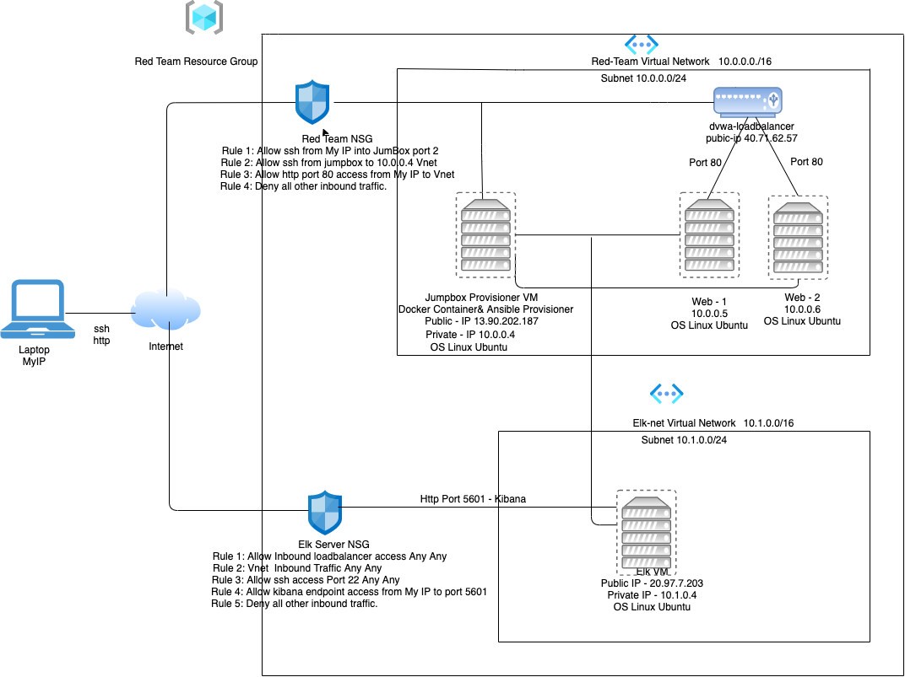
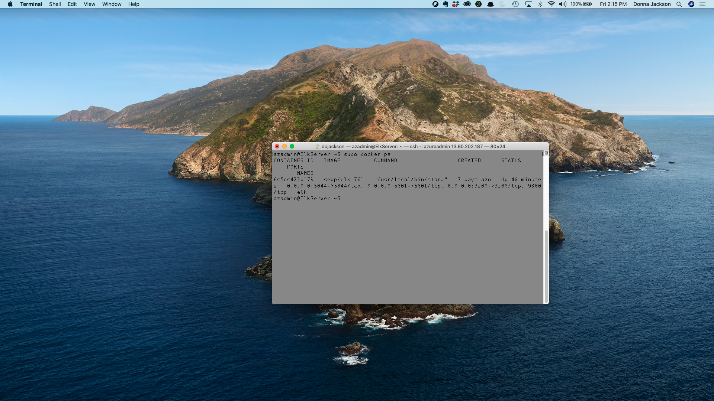

## Automated ELK Stack Deployment

The files in this repository were used to configure the network depicted below.




These files have been tested and used to generate a live ELK deployment on Azure. They can be used to either recreate the entire deployment pictured above. Alternatively, select portions of the .yml file may be used to install only certain pieces of it, such as Filebeat.

The following ansible-playbooks are needed to create and install DVWA and the ELK-server

  - pentest.yml - used to install DVWA on webserverss
  - install-elk.yml -used to install ELK server
    - filebeat-playbook.yml - Use to install and configure Filebeat on Elk Server and DVWA servers
    - metricbeat-playbook.yml - Used to install and configure Metricbeat on Elk Server and DVWA servers


This document contains the following details:
- Description of the Topology
- Access Policies
- ELK Configuration
  - Beats in Use
  - Machines Being Monitored
- How to Use the Ansible Build


### Description of the Topology

The main purpose of this network is to expose a load-balanced and monitored instance of DVWA, the D*mn Vulnerable Web Application.

Load balancing ensures that the application will be highly available, in addition to restricting access to the network.

- Jumpbox is used to restrict and monitor access to the production network.the Jumpbox serves as a single access point for administration tasks which allows for implementing and managing least privilege.


Integrating an ELK server allows users to easily monitor the vulnerable VMs for changes to the system configuration files and system performance.

- Filebeat is an open-source lightweight data shippers that you install as agents on your servers to send operational data to Elasticsearch.
-  Metricbeat is a lightweight shipper that you can install on your servers to periodically collect metrics from the operating system and from services running on the server. 

The configuration details of each machine may be found below.


| Name       | Function   | IP Address | Operating System          |   |
|------------|------------|------------|---------------------------|---|
| Jumpbox    | Gateway    | 10.0.0.4   | Linux - 49~18.04.1-Ubuntu |   |
| Web 1      | Web Server | 10.0.0.5   | Linux - 49~18.04.1-Ubuntu |   |
| Web 2      | Web Server | 10.0.0.6   | Linux - 49~18.04.1-Ubuntu |   |
| Elk Server | Log Server | 10.1.0.4   | Linux - 49~18.04.1-Ubuntu |   |

### Access Policies

The machines on the internal network are not exposed to the public Internet. 

Only the jumpbox machine can accept connections from the Internet. Access to this machine is only allowed from the following IP addresses:

- My Ip Adress which can be found by launching https://whatismyipaddress.com/ from personal laptop/workstation

Machines within the network can only be accessed from the jumpbox which also houses the docker container code and the ansible provisioner.

- The ELK VM can be accessed from the ansible container ssh port 22 and port 5601 kibana front end webserver.

A summary of the access policies in place can be found in the table below.

| Name         | Publicly Accessible | Allowed IP Address |
|--------------|---------------------|:------------------:|
| Jumpbox      | Yes                 | My Ip Address      |
| Loadbalancer | Yes Port 80         | My Ip Address      |
| Web 1        | No                  | 10.0.0.5           |
| Web 2        | No                  | 10.0.0.6           |
| Elk Server   | Yes Port 5601       | My Ip Address      |


### Elk Configuration

Ansible was used to automate configuration of the ELK machine. No configuration was performed manually, which is advantageous because...


- Ansible is an open-source automation tool that simplifies complex tasks.  Automation is crucial allowing IT environments the flexibility to scale very quickly. System administrators and developers no longer have to manually deploy code ,frees up timeto focus on other tasks.


The playbook implements the following tasks:
- Installs docker.io, pip3, and the docker module.
```bash
  # Use apt module
    - name: Install docker.io
      apt:
        update_cache: yes
        name: docker.io
        state: present

  # Use apt module
    - name: Install pip3
      apt:
        force_apt_get: yes
        name: python3-pip
        state: present

  # Use pip module
    - name: Install Docker python module
      pip:
        name: docker
        state: present
```   
- increases the virtual memory (for the virtual machine we will use to run the ELK server)
```bash
  # Use command module
    - name: Increase virtual memory
      command: sysctl -w vm.max_map_count=262144
```
- uses sysctl module
```bash
  # Use sysctl module
    - name: Use more memory
      sysctl:
        name: vm.max_map_count
        value: "262144"
        state: present
        reload: yes
```
- downloads and launches the docker container for elk server 
```bash


# Use docker_container module
    - name: download and launch a docker elk container
      docker_container:
        name: elk
        image: sebp/elk:761
        state: started
        restart_policy: always
        published_ports:
          - 5601:5601
          - 9200:9200
          - 5044:5044
          
The following screenshot displays the result of running `docker ps` after successfully configuring the ELK instance.


### Target Machines & Beat
This ELK server is configured to monitor the following machines:

- Web 1 - 10.0.0.5
- Web 2 - 10.0.0.6 

We have installed the following Beats on these machines:
- FileBeat
- Metric Beat


These Beats allow us to collect the following information from each machine:

- Filebeat is an open-source lightweight data shippers that you install as agents on your servers to send operational data to Elasticsearch. Filebeat allows you to monitor and analyze system logs in a single pane. 
-  Metricbeat is a lightweight shipper that you can install on your servers to periodically collect metrics from the operating system and from services running on the server. 

### Using the Playbook
In order to use the playbook, you will need to have an Ansible control node already configured. Assuming you have such a control node provisioned: 

SSH into the control node and follow the steps below:

- Creating the Filebeat Configuration File filebeat-config.yml.Replace the IP address with the IP address of your ELK machine. 
output.elasticsearch:

  hosts: "10.1.0.4:9200"
  username: "elastic"
  password: "changeme"

  setup.kibana:
  host: "10.1.0.4:5601"

- Copy the configuration file to /etc/ansible/files

- Creating Filebeat Installation Playbook - /etc/ansible/filebeat-playbook.yml. The playbook installs the code and sets the filebeat system settings.

- Run the playbook ansible-playbook filebeat-playbook.yml, then navigate to http://[Elk_VM_Public_IP]:5601/app/kibana to confirm that the installation worked as expected.


